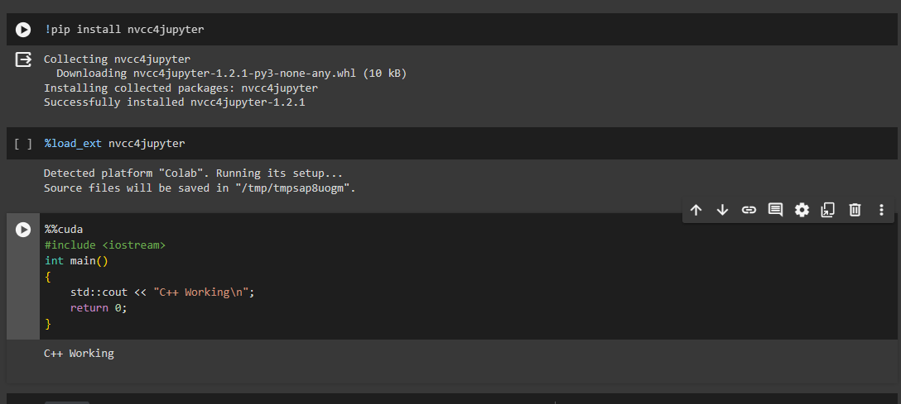
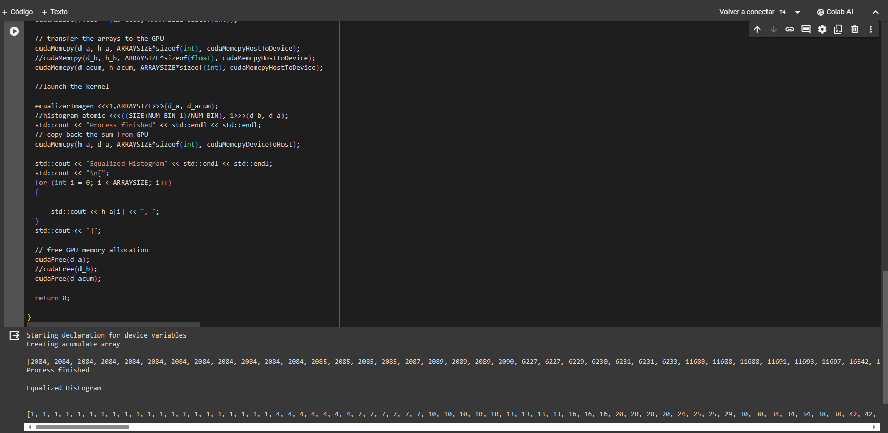
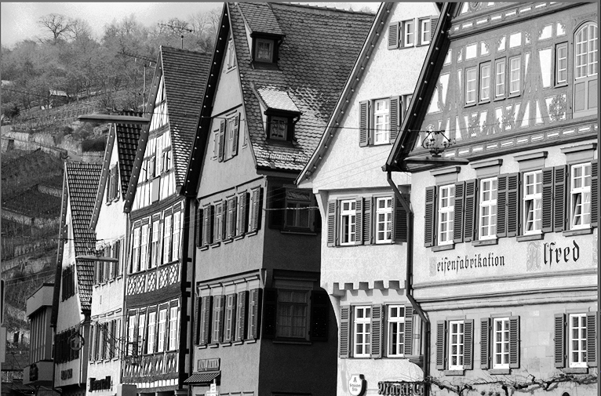

# VisionArtificial

## Acerca del Proyecto

El presente proyecto es del curso de Vision Artificial en grupo donde los integrantes somos:

* Ing. Alpaca Rendon, Jesus A.
* Ing. Ccallo Fernandez, Adolfo
* Ing. del Carpio Maraza, Heberth E.
* Ing. Vargas Franco, Mauricio S.

El proyecto consta de la resolucion de las tareas en el siguiente orden:

1. Cambiar el Brillo/Contraste de una imagen
2. Ecualizar una imagen
3. Sumar/Restar imagenes

## Descripcion

El proyecto consta de 3 subcarpetas:
* Tarea1
* Tarea2
* Tarea3

Dentro de cada una se encontrara la resolucion en CUDA con C++ y OpenCV con Python/C++ donde colocamos el codigo desarrollado y las imagenes utilizadas para su resolucion.

## Intrucciones

### TAREA 1

**Descripcion**: Realizar utilizando CUDA con C++ el script para generar el histograma de cambio de brillo y otro de contraste

**Archivos**: 

**Solucion**: 
1. Ingresamos a Colab y abrimos el archivo(`Tarea1/brillo_contraste.ipynb`).
2. Una vez abierto, ejecutamos en orden los comandos.
3. Usamos OPENCV para cargar las imagenes y pasarlas a 2 matriz de dos dimensiones.

4. Reducimos el tamaño de las matrices para facilitar el proceso y que ambas sean de la misma dimensión

5. Declaramos la función CUDA para poder aumentar o reducir el brillo y el contraste: R(x, y):= (A(x,y) + factor para el brillo y R(x, y):= (A(x,y) * factor para el contraste, donde la matriz resultante es la asición o multiplicaciòn por una constantente.
6. Declaramos las filas y columnas y tamaño de las matrices
7. Copiamos la matriz a una varable declarada en cuda/c++
8. Declaramos la matriz de salida
9. Procedemos a localizar la memoria en el GPU
10. Copiamos las matrices A del host al device
11. Definimos red y los bloques
12. Lanzamos la funcion Kernel
13. Copiamos la matriz resultante del device(gpu) al host
14. Liberamos la memoria del gpu.
**Screenshots de Test**:

## TAREA 2 

**Descripcion**: Realizar utilizando CUDA con C++ el script para generar el histograma de ecualizacion de una imagen

**Archivos**: 
* Carpeta "Imagenes": imagenes de prueba del script
* Script EcualizarImagen: Script del Colab(principal)
* Proyecto Ecualizador en VS: Proyecto en Visual Studio 2022 con OpenCV para obtener el histograma y mostrar las imagenes de resultado.

**Solucion**: 

1. Ingresamos a Colab y abrimos el archivo(`Tarea2/EcualizarImagen.ipynb`)
2. Una vez abierto, ejecutamos en orden los comandos como aparece en la imagen:

3. Llegamos al cuarto cuadro y veremos el codigo el cual tiene definido un histograma de la imagen que se tomo como ejemplo, en este caso de la imagen en (`Tarea2/Imagenes/kodim08_grayscale.png`)
4. Ejecutamos el codigo.
5. Tendremos la salida por pantalla de los pasos que esta realizando

    * Primero mostrara un mensaje de inicio
    * Segundo un array de las acumulaciones
    * Tercero, un array indicando el inicio y fin del proceso
    * Y por ultimo el array del histograma ecualizado, indicando las frecuencias por cada posicion.
    * Podemos llevar este array a los proyectos de Visual Studio 2022 de la carpeta "Ecualizador" y verificar el resultado en imagen.

**Screenshots de Test**:

## TAREA 3 

**Descripcion**: Realizar utilizando CUDA con C++ el script para generar el histograma de suma y resta de imagenes

**Archivos**: 
* Imagenes: imagenes de prueba del script
* Script de Suma y Resta: Script del Colab(principal)

**Solucion**: 

1. Ingresamos a Colab y abrimos el archivo(`Tarea3/sumar_dos_imagenes.ipynb`)
2. Una vez abierto, ejecutamos en orden los comandos
3. Usamos OPENCV para cargar las imagenes y pasarlas a 2 matrices de dos dimensiones

4. Reducimos el tamaño de las matrices para facilitar el proceso y que ambas sean de la misma dimensión

5. Declaramos la función CUDA para poder sumar/restar las matrices usando: R(x, y):= (A(x,y)+B(x,y))/2 donde la matriz resultante es la división entre dos de la suma de las dos matrices.

6. Declaramos las filas y columnas y tamaño de las matrices

7. Copiamos la matriz a una varable declarada en cuda/c++

8. Declaramos la matriz de salida

9. Procedemos a localizar la memoria en el GPU

10. Copiamos las matrices A y B del host al device

11. Definimos red y los bloques

12. Lanzamos la funcion Kernel

13. Copiamos la matriz resultante del device(gpu) al host

14. Liberamos la memoria del gpu.

## TAREA 4

**Descripción**: Realizar utilizando CUDA con C++ el script para generar una convolución

**Archivos**: 
* Imagen: Imagen de prueba del script
* Script Convolución: Script del Colab(principal)

**Solución**: 

1. Ingresamos a Colab y abrimos el archivo(`Tarea4/Convolucion.ipynb`)
2. Una vez abierto, ejecutamos en orden los comandos
3. Usamos OPENCV para cargar la imagen y pasarla a una matriz.

4. Reducimos el tamaño de la matriz.

5. Declaramos la máscara

6. Dimensionamos la matriz, declaramos la máscara.

7. Declaramos la función iterativa para que la convolución se realice y la máscara se efectúe sobre la imagen sin salirse del rango.

8. Copiamos la matriz a una varable declarada en cuda/c++

9. Declaramos la matriz de salida/resultado

10. Procedemos a localizar la memoria en el GPU

11. Copiamos las matrices A del host al device

12. Definimos red y los bloques

13. Lanzamos la funcion Kernel

14. Copiamos la matriz resultante del device(gpu) al host

15. Liberamos la memoria del gpu.

## TAREA  

**Descripcion**: Realizar utilizando CUDA con C++ el script para generar un caso de template matching con una matriz de imagen principal, otra de template y que vaya generando submatrices con las mismas dimensiones y utilizando una formula de medida(en este caso se utilizo distancia euclidiana), considere el minimo valor e indique las coordenadas iniciales donde se encontro este punto.

**Archivos**: 
* Carpeta "Imagenes": imagenes de prueba del script
* Proyecto templateMatching: Proyecto en Visual Studio 2022 con OpenCV para obtener la matriz de datos de la imagen y template
* Proyecto TMachingv1 en VS2022: Proyecto en Visual Studio 2022 con CUDA para obtener el valor de los puntos minimos cercanos con template matching.

**Solucion**: 

1. Ingresamos a Colab y abrimos el archivo(`Tarea2/EcualizarImagen.ipynb`)
2. Una vez abierto, ejecutamos en orden los comandos como aparece en la imagen:
<!--  -->
3. Llegamos al cuarto cuadro y veremos el codigo el cual tiene definido un histograma de la imagen que se tomo como ejemplo, en este caso de la imagen en (`Tarea2/Imagenes/kodim08_grayscale.png`)
4. Ejecutamos el codigo.
5. Tendremos la salida por pantalla de los pasos que esta realizando

    * Primero mostrara un mensaje de inicio
    * Segundo un array de las acumulaciones
    * Tercero, un array indicando el inicio y fin del proceso
    * Y por ultimo el array del histograma ecualizado, indicando las frecuencias por cada posicion.
    * Podemos llevar este array a los proyectos de Visual Studio 2022 de la carpeta "Ecualizador" y verificar el resultado en imagen.

**Screenshots de Test**:

<!-- 

 -->
